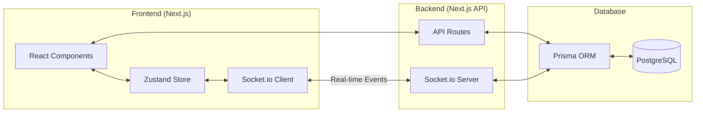
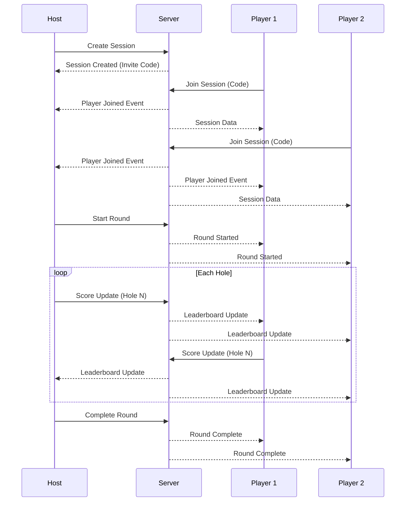
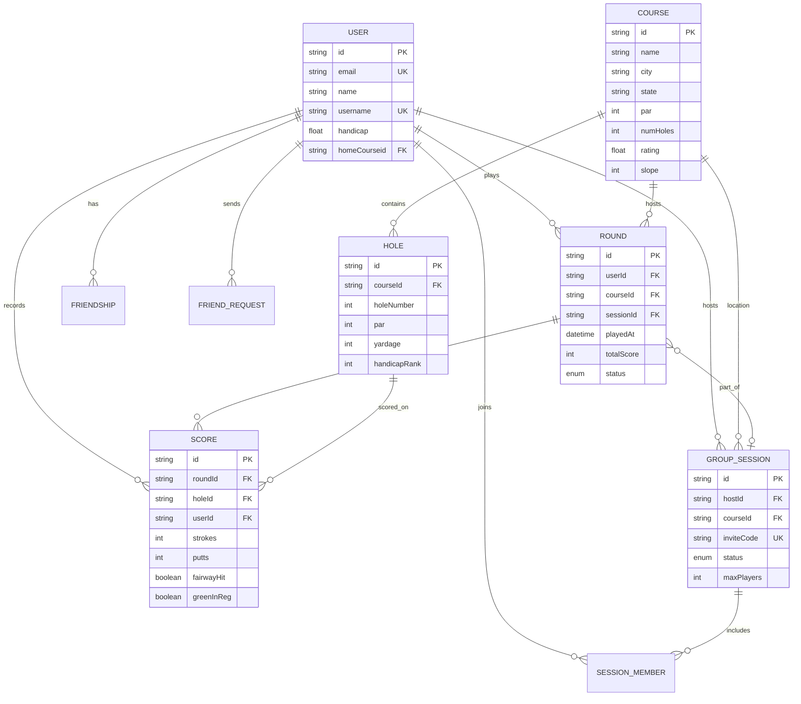

# Fairway Golf Tracker - App Architecture & Flow

## Overview
A web app for golfers to track scores over time, by location, with solo and multiplayer modes.

---

## User Flow Diagram

```mermaid
flowchart TB
    subgraph AUTH["🔐 Authentication"]
        LOGIN[Login Page]
        SIGNUP[Sign Up Page]
    end

    subgraph DASH["🏠 Dashboard"]
        HOME[Home Page]
        PLAY_TAB[Play Tab]
        HISTORY_TAB[History Tab]
        STATS_TAB[Stats Tab]
        FRIENDS_TAB[Friends Tab]
    end

    subgraph SOLO["⛳ Me Time - Solo Mode"]
        NEW_ROUND[New Round Page]
        COURSE_SELECT[Select Course]
        WEATHER[Set Weather]
        ACTIVE_ROUND[Active Round]
        SCORECARD[Hole-by-Hole Scorecard]
        ROUND_SUMMARY[Round Summary]
    end

    subgraph GROUP["👥 Group Compete - Multiplayer"]
        CREATE_SESSION[Create Session]
        JOIN_SESSION[Join Session]
        INVITE_CODE[Enter Invite Code]
        SESSION_LOBBY[Session Lobby]
        LIVE_ROUND[Live Round]
        LEADERBOARD[Real-time Leaderboard]
        GROUP_CHAT[Group Chat]
    end

    subgraph STATS["📊 Statistics & Metrics"]
        STATS_OVERVIEW[Stats Overview]
        SCORE_TRENDS[Score Trends]
        PAR_PERF[Par Performance]
        COURSE_STATS[Course Statistics]
        HANDICAP[Handicap Tracking]
    end

    subgraph SOCIAL["🤝 Friends & Social"]
        FRIENDS_LIST[Friends List]
        FRIEND_REQUESTS[Friend Requests]
        FIND_FRIENDS[Find Friends]
        H2H[Head-to-Head Stats]
        CHALLENGE[Challenge Friend]
    end

    %% Main Navigation
    LOGIN --> HOME
    SIGNUP --> HOME
    HOME --> PLAY_TAB
    HOME --> HISTORY_TAB
    HOME --> STATS_TAB
    HOME --> FRIENDS_TAB

    %% Solo Flow
    PLAY_TAB -->|"Me Time"| NEW_ROUND
    NEW_ROUND --> COURSE_SELECT
    COURSE_SELECT --> WEATHER
    WEATHER --> ACTIVE_ROUND
    ACTIVE_ROUND --> SCORECARD
    SCORECARD -->|"Complete 18 holes"| ROUND_SUMMARY
    ROUND_SUMMARY --> HOME

    %% Group Flow
    PLAY_TAB -->|"Create"| CREATE_SESSION
    PLAY_TAB -->|"Join"| JOIN_SESSION
    CREATE_SESSION --> SESSION_LOBBY
    JOIN_SESSION --> INVITE_CODE
    INVITE_CODE --> SESSION_LOBBY
    SESSION_LOBBY -->|"Start Round"| LIVE_ROUND
    LIVE_ROUND --> LEADERBOARD
    LIVE_ROUND --> GROUP_CHAT
    LEADERBOARD --> ROUND_SUMMARY

    %% Stats Flow
    STATS_TAB --> STATS_OVERVIEW
    STATS_OVERVIEW --> SCORE_TRENDS
    STATS_OVERVIEW --> PAR_PERF
    STATS_OVERVIEW --> COURSE_STATS
    STATS_OVERVIEW --> HANDICAP

    %% Friends Flow
    FRIENDS_TAB --> FRIENDS_LIST
    FRIENDS_LIST --> H2H
    FRIENDS_TAB --> FRIEND_REQUESTS
    FRIENDS_TAB --> FIND_FRIENDS
    H2H --> CHALLENGE
    CHALLENGE --> CREATE_SESSION
```



---

## Data Flow Diagram



---

## Real-time Events Flow (Group Mode)



---

## Database Schema Overview



---

## File Structure

```
golf-tracker/
├── prisma/
│   └── schema.prisma          # Database schema
├── src/
│   ├── app/
│   │   ├── api/
│   │   │   ├── friends/       # Friends API routes
│   │   │   ├── rounds/        # Rounds API routes
│   │   │   ├── scores/        # Scores API routes
│   │   │   ├── sessions/      # Group sessions API
│   │   │   └── stats/         # Statistics API
│   │   ├── friends/
│   │   │   └── page.tsx       # Friends management
│   │   ├── round/
│   │   │   ├── new/
│   │   │   │   └── page.tsx   # Start new round
│   │   │   └── [id]/
│   │   │       └── page.tsx   # Active round scorecard
│   │   ├── session/
│   │   │   ├── new/
│   │   │   │   └── page.tsx   # Create group session
│   │   │   ├── join/
│   │   │   │   └── page.tsx   # Join with invite code
│   │   │   └── [code]/
│   │   │       └── page.tsx   # Active group session
│   │   ├── stats/
│   │   │   └── page.tsx       # Detailed statistics
│   │   ├── globals.css        # Global styles
│   │   ├── layout.tsx         # Root layout
│   │   └── page.tsx           # Dashboard home
│   ├── components/
│   │   ├── providers.tsx      # Context providers
│   │   └── scorecard.tsx      # Scorecard components
│   ├── lib/
│   │   ├── auth.ts            # Authentication utils
│   │   ├── golf-utils.ts      # Golf scoring utilities
│   │   ├── prisma.ts          # Prisma client
│   │   └── socket.ts          # Socket.io setup
│   ├── stores/
│   │   └── index.ts           # Zustand state stores
│   └── types/
│       └── index.ts           # TypeScript types
├── tailwind.config.ts         # Tailwind configuration
└── package.json               # Dependencies
```

---

## Key Features Summary

| Feature | Description | Status |
|---------|-------------|--------|
| **Me Time Mode** | Solo round tracking with hole-by-hole scoring | ✅ Built |
| **Group Compete** | Real-time multiplayer with live leaderboard | ✅ Built |
| **Score Tracking** | Strokes, putts, FIR, GIR, penalties | ✅ Built |
| **Course Management** | Store and select golf courses | ✅ Built |
| **Statistics** | Trends, averages, par performance | ✅ Built |
| **Friends System** | Add friends, head-to-head records | ✅ Built |
| **Real-time Updates** | Socket.io for live score syncing | ✅ Built |
| **Responsive Design** | Mobile-first, works on all devices | ✅ Built |
